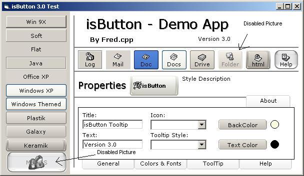



## IsButton \(by Fred cpp\)

### Description

I didn't write the code myself as I already stated in the name. The original submission was made by fred cpp. I just added support for grayscale icon when enable property was set to false.

I don't need any vote, I added this functionality  because I needed this control in my project + the fact that it does not look user friendly having a disabled button with a normal icon drawed in it :)

BTW The code added to the control was excerpted from vlad Memorydc class.
 
### More Info
 

             |
---                |---
**Submitted On**   |2005-04-11 19:47:30
**By**             |[dvrdsr](https://github.com/Planet-Source-Code/PSCIndex/blob/master/ByAuthor/dvrdsr.md)
**Level**          |Intermediate
**User Rating**    |4.6 (23 globes from 5 users)
**Compatibility**  |VB 5\.0, VB 6\.0
**Category**       |[OLE/ COM/ DCOM/ Active\-X](https://github.com/Planet-Source-Code/PSCIndex/blob/master/ByCategory/ole-com-dcom-active-x__1-29.md)
**World**          |[Visual Basic](https://github.com/Planet-Source-Code/PSCIndex/blob/master/ByWorld/visual-basic.md)
**Archive File**   |[IsButton\_\(1905996272005\.zip](https://github.com/Planet-Source-Code/dvrdsr-isbutton-by-fred-cpp__1-61352/archive/master.zip)

